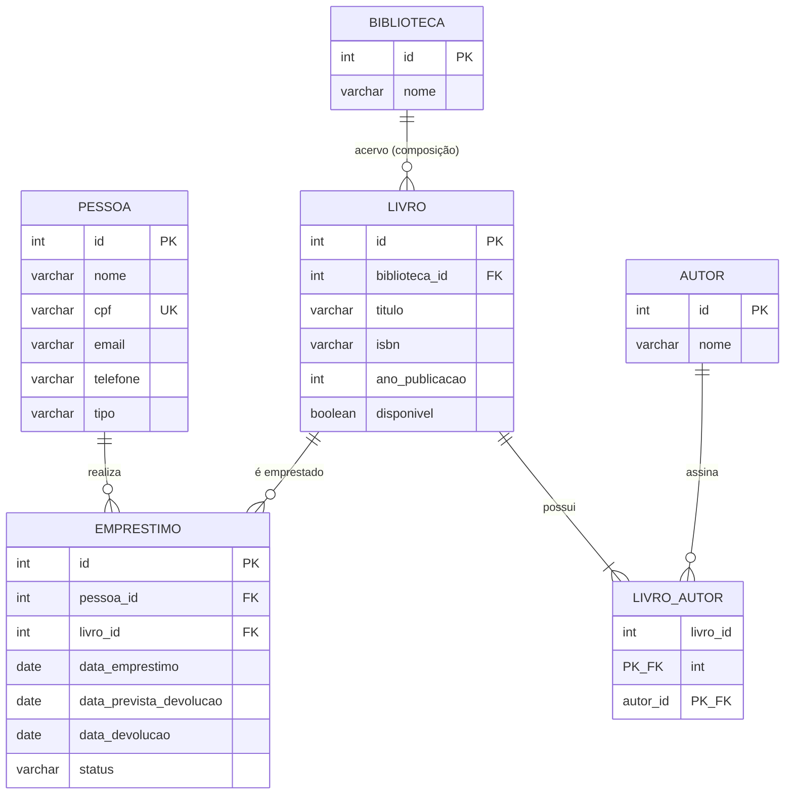

# DER (Mermaid)

Fonte equivalente a `der.puml`. Usar se o PlantUML não estiver disponível para renderizar a imagem.

Cardinalidades mínimas: `BIBLIOTECA` pode existir sem livros (o `schema.sql` já
insere uma biblioteca vazia) e `AUTOR` pode ser cadastrado antes de qualquer
associação (RF06) — por isso `o{` nos dois casos. `LIVRO ||--|{ LIVRO_AUTOR`
representa RN10 (livro com ao menos um autor), que é regra de negócio validada
na camada `service`: o DDL não impõe cardinalidade mínima em tabela associativa.
