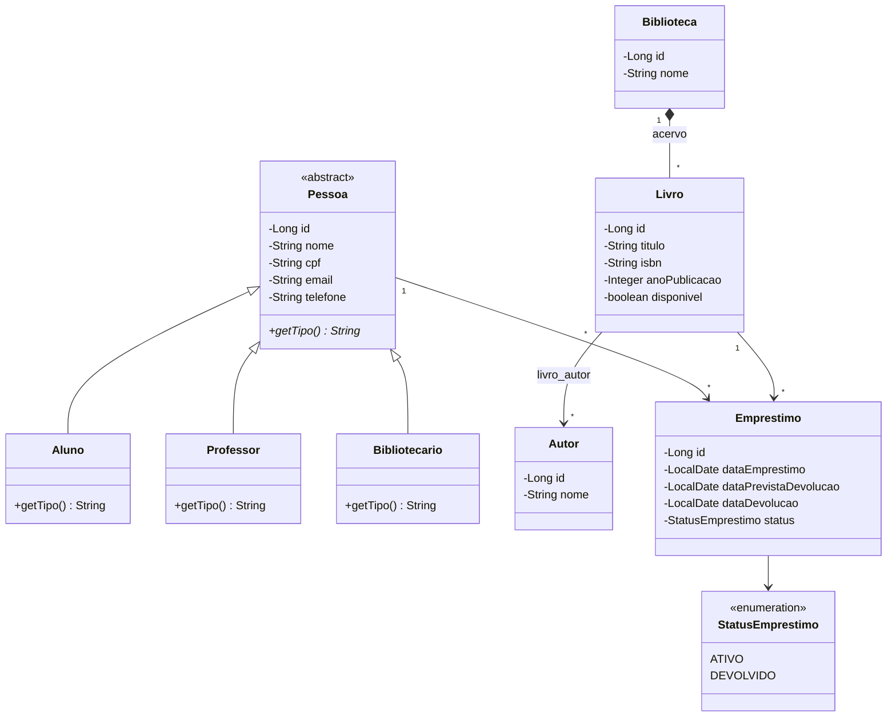

# Diagrama de classes (Mermaid)

Fonte equivalente a `diagrama-classes.puml`. Usar se o PlantUML não estiver disponível para renderizar a imagem.

```mermaid
classDiagram
    class Biblioteca {
        -Long id
        -String nome
    }
    class Pessoa {
        <<abstract>>
        -Long id
        -String nome
        -String cpf
        -String email
        -String telefone
        +getTipo()* String
    }
    class Aluno {
        +getTipo() String
    }
    class Professor {
        +getTipo() String
    }
    class Bibliotecario {
        +getTipo() String
    }
    class Livro {
        -Long id
        -String titulo
        -String isbn
        -Integer anoPublicacao
        -boolean disponivel
    }
    class Autor {
        -Long id
        -String nome
    }
    class Emprestimo {
        -Long id
        -LocalDate dataEmprestimo
        -LocalDate dataPrevistaDevolucao
        -LocalDate dataDevolucao
        -StatusEmprestimo status
    }
    class StatusEmprestimo {
        <<enumeration>>
        ATIVO
        DEVOLVIDO
    }
    Pessoa <|-- Aluno
    Pessoa <|-- Professor
    Pessoa <|-- Bibliotecario
    Biblioteca "1" *-- "*" Livro : acervo
    Livro "*" --> "*" Autor : livro_autor
    Pessoa "1" --> "*" Emprestimo
    Livro "1" --> "*" Emprestimo
    Emprestimo --> StatusEmprestimo
```
