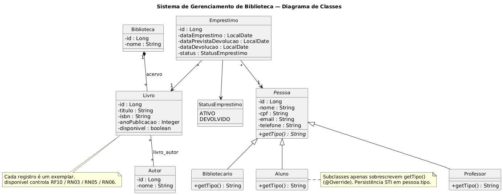
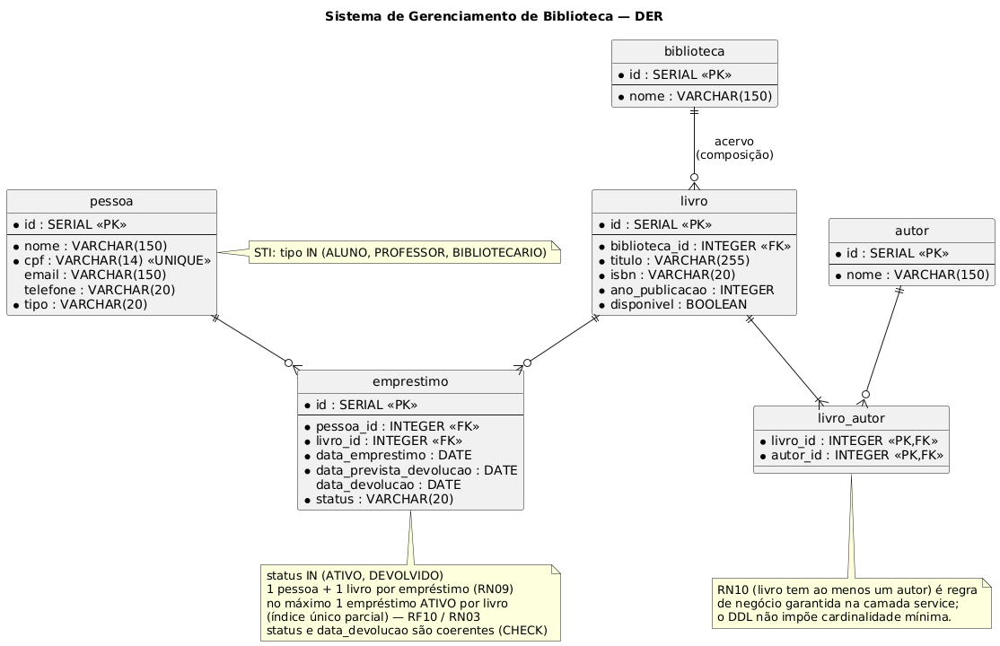

# Sistema de Gerenciamento de Biblioteca

**AEP 4º semestre — Engenharia de Software**  
**Semestre:** 2026.2  
**Entrega:** 1ª (planejamento e arquitetura)

| Integrante | RA |
|---|---|
| Gianlucca Barraco Pimentel | 26007478-2 |
| Nickolay Alexander Justini Dias | 26007083-2 |

**Repositório GitHub (público):** https://github.com/gianluccapimentel/trabalhoAEP2026.2

---

## 1. Identificação do projeto

Este documento constitui a **primeira entrega** da Atividade Extensionista e Profissionalizante (AEP) do 4º semestre. A AEP é um trabalho interdisciplinar obrigatório que integra conhecimentos de Banco de Dados, Programação Orientada a Objetos, Sistemas Operacionais, Engenharia de Requisitos, Gestão de Projetos e ETI, por meio do desenvolvimento incremental de uma solução computacional alinhada a um Objetivo de Desenvolvimento Sustentável (ODS) da ONU.

A primeira entrega cobre descoberta, concepção, requisitos, regras de negócio, modelo de classes, DER, justificativa técnica, estrutura do repositório e cronograma. **Não há código funcional nesta etapa.** A segunda entrega implementará a aplicação Java com CRUD persistido em PostgreSQL, sem alterar o contrato definido aqui.

---

## 2. Descoberta

### 2.1 Contexto

Bibliotecas acadêmicas precisam controlar, ao mesmo tempo, o acervo (livros/exemplares), as pessoas que os utilizam (alunos, professores e bibliotecários), os autores das obras e o ciclo de empréstimo/devolução. Quando esse controle é manual ou fragmentado, surgem inconsistências: dificuldade para localizar um título, incerteza sobre a disponibilidade, empréstimos sem rastreio, perda de histórico e retrabalho administrativo.

### 2.2 Problema central

**Como organizar e centralizar o gerenciamento de livros e empréstimos de uma biblioteca acadêmica de forma simples, consistente e persistente?**

### 2.3 Partes interessadas

| Parte | Papel |
|---|---|
| **Bibliotecário** | Usuário operacional. Cadastra livros, autores e pessoas; registra empréstimos e devoluções; consulta o acervo e o histórico. |
| **Aluno** | Usuário da biblioteca. Possui cadastro, empréstimos ativos e histórico. |
| **Professor** | Usuário acadêmico. Mesma estrutura geral de `Pessoa`, com especialização para demonstrar herança. |
| **Administração da biblioteca** | Responsável pela integridade dos dados e pela operação contínua do acervo. |

### 2.4 Atores do sistema

- **Bibliotecário:** executa operações administrativas e de circulação (empréstimo/devolução).
- **Aluno:** utiliza a biblioteca como usuário tomador de empréstimo.
- **Professor:** utiliza a biblioteca como usuário acadêmico.

A interface desta AEP é **CLI**. Os atores são representados no domínio (herança de `Pessoa`); quem opera o programa, na prática acadêmica, é o bibliotecário ou o avaliador executando o menu.

---

## 3. Concepção e alinhamento

### 3.1 Solução proposta

Desenvolver uma aplicação **Java 21**, com persistência em **PostgreSQL** via **JDBC**, capaz de cadastrar e gerenciar pessoas, livros, autores e empréstimos. O sistema controla a disponibilidade de cada exemplar e registra retirada e devolução.

A solução é deliberadamente pequena: suficiente para demonstrar POO (classe abstrata, herança, polimorfismo e composição 1:N), CRUD real, SQL e arquitetura em camadas — sem se tornar um sistema comercial.

### 3.2 ODS 4 — Educação de Qualidade

O projeto alinha-se ao **ODS 4** porque bibliotecas acadêmicas organizam o acesso a materiais de estudo, pesquisa e formação. O software **não resolve**, sozinho, problemas educacionais amplos. A contribuição é operacional:

- organização do acervo;
- visibilidade da disponibilidade dos livros;
- controle de empréstimos e devoluções;
- redução de erros administrativos;
- facilidade de consulta;
- apoio ao acesso aos materiais educacionais já existentes.

### 3.3 Escopo desta AEP

**Dentro do escopo**

- Cadastro de pessoas (aluno, professor, bibliotecário)
- Cadastro, consulta, atualização e exclusão de livros (CRUD principal)
- Cadastro de autores e associação N:N com livros
- Registro de empréstimos e devoluções
- Consulta de empréstimos ativos e finalizados
- Controle de disponibilidade do exemplar
- Persistência em PostgreSQL (não listas em memória)
- Validações básicas (RN12)
- Interface de linha de comando (CLI)

**Fora do escopo** (não implementar nesta AEP; possíveis evoluções futuras)

- pagamento, multas financeiras reais, autenticação avançada
- notificações por e-mail/SMS, código de barras, QR Code
- aplicativo mobile, interface gráfica avançada, catálogo público na internet
- inteligência artificial, recomendação de livros
- integração com APIs ou sistemas externos
- arquitetura distribuída e microsserviços

### 3.4 Decisões de modelagem (contrato da 2ª entrega)

Estas decisões permanecem estáveis entre as duas entregas:

| Decisão | Escolha |
|---|---|
| Tema | Biblioteca acadêmica |
| ODS | 4 — Educação de Qualidade |
| Livro | **1 registro = 1 exemplar** (`id`, `titulo`, `isbn`, `anoPublicacao`, `disponivel`) |
| Herança | `Pessoa` abstrata → `Aluno`, `Professor`, `Bibliotecario` |
| Persistência da herança | **STI**: tabela única `pessoa` com coluna `tipo` |
| Subclasses | apenas sobrescrevem `getTipo()` (`@Override`); sem colunas extras |
| Composição 1:N | `Biblioteca` contém `Livro` via `biblioteca_id` |
| Autoria | N:N `Livro`–`Autor` pela tabela `livro_autor` |
| Empréstimo | exatamente 1 pessoa + 1 livro; status `ATIVO` / `DEVOLVIDO` |
| Stack | Java 21, Maven, PostgreSQL, JDBC, CLI; camadas `model` / `repository` / `service` / `controller` / `database` |
| Fora da stack | Spring, Hibernate, GUI |

**Sobre RF01 e quantidade de exemplares.** O requisito funcional pede título, ISBN, ano, quantidade de exemplares e disponibilidade. No modelo adotado, a quantidade não é um campo numérico: cada linha de `livro` é um exemplar físico. A “quantidade” de um título é o número de linhas com o mesmo ISBN; a disponibilidade é o booleano `disponivel` de cada exemplar. Isso simplifica empréstimo e devolução (RF07, RF08, RF10) e evita controlar estoque agregado.

---

## 4. Requisitos funcionais

Os requisitos abaixo são o **contrato** do projeto e devem ser preservados na implementação.

### RF01 — Cadastro de livros

O sistema deve permitir o cadastro de livros, contendo pelo menos: título; ISBN; ano de publicação; quantidade de exemplares; status/disponibilidade.

*Modelagem:* cada cadastro cria um exemplar (`Livro`) com `disponivel`. Quantidade = cardinalidade de registros com o mesmo ISBN.

### RF02 — Consulta de livros

O sistema deve permitir consultar livros cadastrados e verificar sua disponibilidade.

### RF03 — Atualização de livros

O sistema deve permitir alterar os dados de um livro cadastrado.

### RF04 — Exclusão de livros

O sistema deve permitir excluir um livro quando não houver empréstimos ativos associados que impeçam sua remoção (RN08).

### RF05 — Cadastro de pessoas

O sistema deve permitir cadastrar pessoas vinculadas à biblioteca, identificando seu tipo (RN11).

### RF06 — Cadastro de autores

O sistema deve permitir cadastrar autores e associá-los aos livros (RN10).

### RF07 — Registro de empréstimo

O sistema deve permitir registrar um empréstimo associando: usuário; livro; data do empréstimo; data prevista para devolução; status (RN01, RN02, RN04, RN09).

### RF08 — Registro de devolução

O sistema deve permitir registrar a devolução de um empréstimo ativo e atualizar a disponibilidade do livro (RN06, RN07).

### RF09 — Consulta de empréstimos

O sistema deve permitir consultar empréstimos ativos e finalizados.

### RF10 — Controle de disponibilidade

O sistema deve impedir que um exemplar indisponível seja emprestado novamente (RN03, RN05).

---

## 5. Regras de negócio

| ID | Regra |
|---|---|
| **RN01** | Um livro precisa estar cadastrado antes de ser emprestado. |
| **RN02** | Uma pessoa precisa estar cadastrada antes de realizar um empréstimo. |
| **RN03** | Um livro indisponível não pode ser emprestado. |
| **RN04** | Um empréstimo deve possuir uma data de empréstimo e uma data prevista de devolução. |
| **RN05** | Ao registrar um empréstimo, o sistema deve atualizar a disponibilidade do livro. |
| **RN06** | Ao registrar uma devolução, o sistema deve atualizar a disponibilidade do livro. |
| **RN07** | Um empréstimo finalizado não pode ser devolvido novamente. |
| **RN08** | Um livro com empréstimo ativo não deve ser excluído. |
| **RN09** | Um empréstimo deve estar associado a exatamente um usuário e um livro. |
| **RN10** | Um livro pode possuir um ou mais autores. |
| **RN11** | Uma pessoa deve possuir um tipo definido no sistema. |
| **RN12** | A aplicação deve validar dados obrigatórios antes de persistir registros. |

---

## 6. Modelo de classes

O diagrama completo está em `docs/diagrama-classes/` (PlantUML, PNG e SVG).



### 6.1 Classe abstrata

`Pessoa` é abstrata e concentra atributos comuns: `id`, `nome`, `cpf`, `email`, `telefone`. Declara o método abstrato `getTipo(): String`.

### 6.2 Herança

```text
Pessoa
├── Aluno
├── Professor
└── Bibliotecario
```

### 6.3 Polimorfismo

Cada subclasse sobrescreve apenas `getTipo()` com `@Override` (`"Aluno"`, `"Professor"`, `"Bibliotecário"`). Não há atributos extras nas especializações: a diferença é puramente polimórfica, coerente com a tabela única `pessoa`.

### 6.4 Composição 1:N

`Biblioteca (1) ◆—— (*) Livro`

O acervo **pertence** à biblioteca: um `Livro` não existe fora dela. No banco, isso se materializa como `livro.biblioteca_id` com `ON DELETE RESTRICT`. A composição não é artificial: reflete a regra de que o exemplar faz parte de um acervo institucional. O schema insere uma linha inicial em `biblioteca` para viabilizar o cadastro de livros na 2ª entrega.

### 6.5 Demais relacionamentos

- `Livro * —— * Autor` (tabela associativa `livro_autor`)
- `Pessoa 1 —— * Emprestimo`
- `Livro 1 —— * Emprestimo`
- `Emprestimo.status` ∈ {`ATIVO`, `DEVOLVIDO`} (enum `StatusEmprestimo` no modelo OO)

### 6.6 Entidade Livro (exemplar)

```text
Livro
- id
- titulo
- isbn
- anoPublicacao
- disponivel
```

Cada registro é um exemplar gerenciado individualmente. Empréstimo e devolução alteram `disponivel` do próprio registro (RN05 e RN06).

---

## 7. Modelo relacional (DER)

O DER completo está em `docs/der/` (PlantUML, PNG e SVG). O DDL está em `database/schema.sql`.



| Tabela | Papel | Correspondência OO |
|---|---|---|
| `biblioteca` | Acervo institucional | `Biblioteca` |
| `pessoa` | STI de usuários (`tipo`) | `Pessoa` / `Aluno` / `Professor` / `Bibliotecario` |
| `livro` | Exemplar do acervo | `Livro` |
| `autor` | Autores | `Autor` |
| `livro_autor` | Associação N:N | relacionamento `Livro`–`Autor` |
| `emprestimo` | Circulação | `Emprestimo` |

Integridade prevista no schema:

- `pessoa.tipo` ∈ {`ALUNO`, `PROFESSOR`, `BIBLIOTECARIO`}
- `pessoa.cpf` UNIQUE
- `emprestimo.status` ∈ {`ATIVO`, `DEVOLVIDO`}
- FKs com `ON DELETE RESTRICT` (exceto `livro_autor.livro_id`, em `CASCADE` para não orfanar associações ao excluir um livro permitido)
- um único empréstimo `ATIVO` por `livro_id` (índice único parcial) — reforço de RF10/RN03
- `isbn` **não** é UNIQUE, porque vários exemplares do mesmo título podem coexistir

---

## 8. Correspondência requisito → classe → tabela

| Requisito | Classes / serviços previstos | Tabelas |
|---|---|---|
| RF01–RF04 | `Livro`, `LivroService`, `LivroRepository` | `livro`, `biblioteca` |
| RF05, RN11 | `Pessoa`, `Aluno`, `Professor`, `Bibliotecario` | `pessoa` |
| RF06, RN10 | `Autor`, `Livro` | `autor`, `livro_autor` |
| RF07–RF09, RN01–RN09 | `Emprestimo`, `EmprestimoService` | `emprestimo` |
| RF10, RN03, RN05, RN06 | `Livro.disponivel` | `livro.disponivel` |

Toda funcionalidade da 2ª entrega deve respeitar esta cadeia: requisito → regra → classe → service → repository → tabela.

---

## 9. Justificativa técnica e arquitetural

### 9.1 Java 21

Linguagem cobrada nas disciplinas de POO do curso. Permite classe abstrata, herança, `@Override` e composição de forma explícita, sem frameworks que escondam esses conceitos. A versão 21 é LTS e está alinhada ao ambiente acadêmico atual.

### 9.2 PostgreSQL

Banco relacional com integridade referencial, tipos adequados (`BOOLEAN`, `DATE`, `SERIAL`), restrições `CHECK` e índices parciais. Adequado ao DER, ao ensino de SQL e à execução local. Não se usa banco em memória como substituto.

### 9.3 JDBC (sem Hibernate / JPA)

A persistência será feita com JDBC para que o SQL, as transações e o mapeamento objeto-relacional permaneçam visíveis no código. Hibernate/JPA ocultariam o DDL e reduziriam o valor didático da disciplina de Banco de Dados.

### 9.4 Maven

Gerencia dependências (driver PostgreSQL e JUnit) e o ciclo de vida (`compile`, `test`, `package`) de forma reproduzível, sem caminhos específicos da máquina dos integrantes.

### 9.5 Arquitetura em camadas

```text
src/main/java/br/biblioteca/
├── model/         entidades e polimorfismo (Pessoa, Livro, Emprestimo…)
├── repository/    JDBC: insert, update, delete, select
├── service/       RF e RN (validações, disponibilidade, exclusão)
├── controller/    interpreta o menu CLI e chama os serviços
├── database/      conexão JDBC (credenciais via ambiente)
└── Main.java      ponto de entrada (2ª entrega)
```

Separar responsabilidades facilita testes pontuais das regras (por exemplo, recusar empréstimo de livro indisponível) e mantém o CLI desacoplado do SQL.

### 9.6 Interface CLI

A AEP não exige GUI avançada. Um menu textual reduz o esforço de interface e concentra a avaliação em POO, CRUD, banco e arquitetura. Esboço previsto para a 2ª entrega:

```text
=================================
 SISTEMA DE BIBLIOTECA
=================================
1 - Gerenciar livros
2 - Gerenciar autores
3 - Gerenciar pessoas
4 - Realizar empréstimo
5 - Registrar devolução
6 - Consultar empréstimos
0 - Sair
```

### 9.7 O que não será usado

Spring Boot, Hibernate, interfaces gráficas, autenticação avançada e APIs REST. Essas tecnologias aumentariam o escopo sem contribuir para os critérios da rubrica.

### 9.8 Configuração e Sistemas Operacionais

A aplicação será executável em qualquer ambiente com **Java 21** e **PostgreSQL**. Credenciais não ficam no código: o arquivo `.env` (ignorado pelo Git) replica `.env.example` (`DB_URL`, `DB_USER`, `DB_PASSWORD`). Instruções de instalação e execução estão no `README.md`, sem caminhos específicos de um computador.

---

## 10. Estrutura do repositório

```text
/
├── src/main/java/br/biblioteca/{model,repository,service,controller,database}
├── src/test/java
├── docs/diagrama-classes/
├── docs/der/
├── docs/documentacao/
├── database/schema.sql
├── README.md
├── pom.xml
├── .gitignore
└── .env.example
```

Os pacotes Java existem nesta entrega (via `package-info.java`) para o GitHub já nascer com a árvore da 2ª entrega. **Não há `Main.java` nem CRUD nesta etapa.**

O repositório é **público**: https://github.com/gianluccapimentel/trabalhoAEP2026.2  
Ambos os integrantes devem realizar commits reais e coerentes (já na 1ª entrega e, principalmente, na 2ª).

---

## 11. Cronograma (2026.2)

Este cronograma é um **plano de trabalho** da equipe (gestão de projetos): quem faz o quê e em qual janela do semestre. **Não descreve o histórico de commits** nem substitui o calendário oficial da disciplina.

As janelas abaixo seguem um 2026.2 típico (1º bimestre ≈ agosto–outubro; 2º bimestre ≈ outubro–dezembro). Se o professor ou o AVA publicarem datas oficiais de entrega, esta tabela deve ser atualizada para coincidir com elas.

### Bimestre 1 — 1ª entrega (ago–out/2026)

| Etapa | Período | Atividade | Responsável |
|---|---|---|---|
| 1 | 03/08/2026 – 08/08/2026 | Definição do tema e ODS | Gianlucca + Nickolay |
| 2 | 10/08/2026 – 15/08/2026 | Levantamento do problema | Gianlucca |
| 3 | 10/08/2026 – 20/08/2026 | Levantamento de requisitos | Nickolay |
| 4 | 17/08/2026 – 22/08/2026 | Definição das regras de negócio | Gianlucca + Nickolay |
| 5 | 24/08/2026 – 05/09/2026 | Modelagem das classes | Gianlucca |
| 6 | 24/08/2026 – 05/09/2026 | Modelagem do banco / DER | Nickolay |
| 7 | 07/09/2026 – 13/09/2026 | Definição da arquitetura | Gianlucca + Nickolay |
| 8 | 07/09/2026 – 13/09/2026 | Criação do repositório | Nickolay |
| 9 | 14/09/2026 – 04/10/2026 | Organização da documentação | Gianlucca |
| 10 | 05/10/2026 – 16/10/2026 | Revisão final da 1ª entrega | Gianlucca + Nickolay |

### Bimestre 2 — 2ª entrega (out–dez/2026)

| Etapa | Período | Atividade | Responsável |
|---|---|---|---|
| 1 | 19/10/2026 – 25/10/2026 | Implementação das entidades | Gianlucca |
| 2 | 19/10/2026 – 01/11/2026 | Implementação da persistência | Nickolay |
| 3 | 26/10/2026 – 08/11/2026 | Implementação dos repositories | Nickolay |
| 4 | 02/11/2026 – 15/11/2026 | Implementação dos services | Gianlucca |
| 5 | 09/11/2026 – 22/11/2026 | Implementação do CRUD | Gianlucca + Nickolay |
| 6 | 16/11/2026 – 29/11/2026 | Implementação da interface CLI | Gianlucca |
| 7 | 16/11/2026 – 29/11/2026 | Integração com PostgreSQL | Nickolay |
| 8 | 30/11/2026 – 06/12/2026 | Testes e correções | Gianlucca + Nickolay |
| 9 | 30/11/2026 – 13/12/2026 | Documentação | Gianlucca |
| 10 | 07/12/2026 – 18/12/2026 | Revisão final e entrega | Gianlucca + Nickolay |

### Distribuição de foco

- **Gianlucca:** requisitos, regras de negócio, `model`, `service`, documentação, parte da CLI.
- **Nickolay:** banco, DER, `repository`, conexão PostgreSQL, estrutura GitHub, documentação técnica.
- **Ambos:** arquitetura, revisão, testes, commits e entrega.

---

## 12. Evoluções futuras (fora da AEP)

Itens que **não** entram no escopo atual, mas podem orientar trabalhos posteriores: autenticação; multas; notificações; reservas; sistema web; aplicativo mobile; recomendações; relatórios gerenciais; integração com catálogo externo; código de barras / QR Code; painel administrativo.

---

## 13. Resultado esperado ao final da AEP

Uma aplicação Java executável que gerencia o acervo básico de uma biblioteca acadêmica e registra empréstimos e devoluções, com PostgreSQL, POO (abstração, herança, polimorfismo, composição), CRUD de `Livro`, SQL em `/database` e repositório Git público. A 2ª entrega deve ser compatível com este documento: **não criar funcionalidades que não tenham sido planejadas aqui.**
